## 0%: 从0开始的Hexo流程图探险

## 15%: Graphviz?Dot?这都是什么🧎‍♀️?

```mermaid
graph TD
  graphviz[Graphviz]

  subgraph " "
    layout[Layouts]
    script[Script Files]
    api[APIs]
  end

  subgraph "APIs子图"
    layout_etc[......]
  end

  subgraph "Script Files子图"
    element[Elements]
    attribute[Attributes]
  end

  subgraph "Layouts子图"
    layout_dot[dot]
    layout_neato[neato]
  end

  subgraph "Elements子图"
    ele_graph[Graph]
    ele_node[Node]
    ele_edge[Edge]
  end

  graphviz --> layout
  graphviz --> script
  graphviz --> api
  api --> layout_etc
  script --> element
  script --> attribute
  layout --> layout_dot
  layout --> layout_neato
  element --> ele_graph
  element --> ele_node
  element --> ele_edge
```

First Term
: This is the definition of the first term.

Second Term
: This is one definition of the second term.
: This is another definition of the second term.