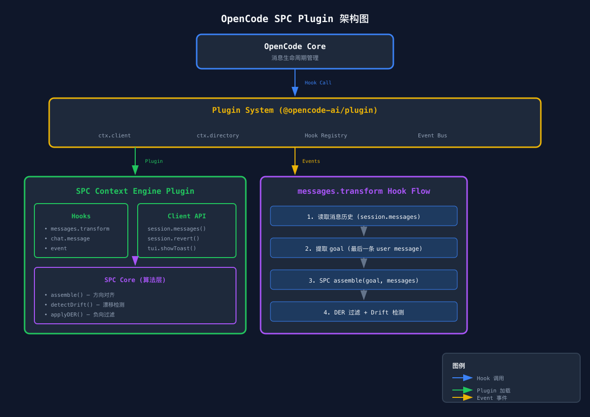
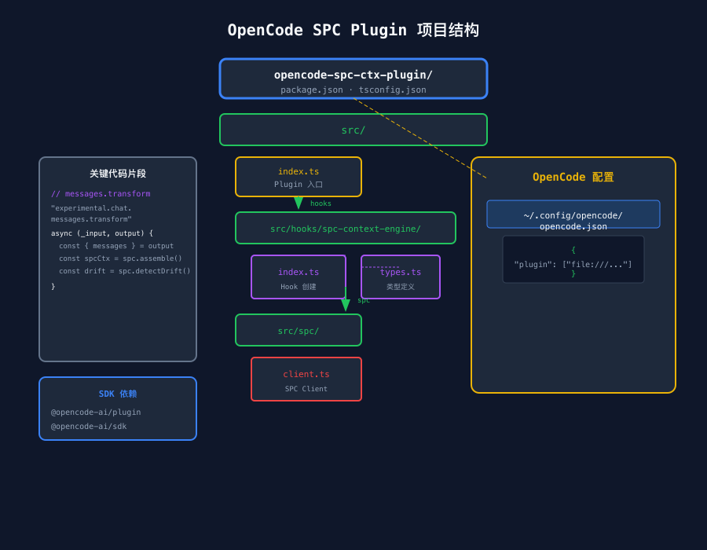

# SPC-CTX OpenCode Plugin: 自定义上下文引擎集成方案

> **目标**: 将 SPC-CTX 作为 OpenCode 插件（`opencode-spc-ctx-plugin`）集成，实现自定义上下文引擎  
> **调研日期**: 2026-04-16  
> **参考实现**: `opensoft/oh-my-opencode` 插件系统

## 1. 背景

OpenCode 是终端 AI 编程助手，支持插件扩展。SPC-CTX 作为上下文引擎，通过 OpenCode 的 `experimental.chat.messages.transform` 钩子集成到消息生命周期中，实现：

- **上下文方向对齐**（assemble）
- **方向漂移检测**（drift detection）
- **负向经验过滤**（DER）
- **上下文压缩**（compact）



## 2. OpenCode 插件系统架构

### 2.1 Plugin 类型定义

```typescript
// 来源: @opencode-ai/plugin
import type { Plugin } from "@opencode-ai/plugin"

type Plugin = (ctx: {
  directory: string
  client: Client
}) => Promise<{
  hooks?: Record<string, HookHandler>
  tools?: ToolDefinition[]
  mcp?: McpServerConfig[]
  config?: Record<string, unknown>
}>
```

### 2.2 Client API

```typescript
type Client = {
  session: {
    messages(opts: { path: { id: string }; query?: { directory?: string } }): Promise<{ data?: Message[] }>
    summarize(opts: { path: { id: string }; body: { providerID: string; modelID: string }; query: { directory: string } }): Promise<unknown>
    revert(opts: { path: { id: string }; body: { messageID: string; partID?: string }; query: { directory: string } }): Promise<unknown>
    prompt_async(opts: { path: { id: string }; body: { parts: Array<{ type: string; text: string }> }; query: { directory: string } }): Promise<unknown>
  }
  tui: {
    showToast(opts: { body: { title: string; message: string; variant: string; duration: number } }): Promise<unknown>
  }
}
```

### 2.3 核心钩子：`experimental.chat.messages.transform`

这是 SPC 实现自定义上下文引擎的**核心钩子**：

```typescript
type MessagesTransformHook = {
  "experimental.chat.messages.transform": (
    input: Record<string, never>,           // 空输入
    output: { messages: MessageWithParts[] } // 消息历史（可修改）
  ) => Promise<void>
}

interface MessageWithParts {
  info: Message  // { id, role, content, sessionID, ... }
  parts: Part[]   // [{ id, type, text, ... }, ...]
}
```

**执行时机**: 在消息发送到大模型之前，允许直接修改完整的消息历史列表

### 2.4 其他辅助钩子

| 钩子名 | 时机 | SPC 用途 |
|--------|------|---------|
| `chat.message` | 每次聊天消息时 | 追加项目上下文 |
| `tool.execute.before` | 工具执行前 | 验证/调整工具输入 |
| `tool.execute.after` | 工具执行后 | 截断工具输出 |
| `session.compacting` | 会话压缩时 | 自定义压缩逻辑 |
| `event` (idle/error/deleted) | 会话状态变化 | 触发 SPC 预热/清理 |

## 3. SPC OpenCode Plugin 设计



### 3.1 插件结构

```
opencode-spc-ctx-plugin/
├── src/
│   ├── index.ts              # Plugin 入口
│   ├── hooks/
│   │   └── spc-context-engine/
│   │       ├── index.ts      # Hook 创建 + 事件处理
│   │       ├── types.ts      # 类型定义
│   │       └── utils.ts     # 辅助函数
│   └── spc/
│       └── client.ts          # SPC Client 封装
├── dist/                     # 编译输出
├── package.json
└── tsconfig.json
```

### 3.2 Plugin 入口

```typescript
// src/index.ts
import type { Plugin } from "@opencode-ai/plugin"
import { createSPCContextEngineHook } from "./hooks/spc-context-engine"

const SPCPlugin: Plugin = async (ctx) => {
  return {
    hooks: {
      ...createSPCContextEngineHook(ctx, {
        driftThreshold: 0.3,
        derCooldownMs: 5000,
        compactRatio: 0.8,
      })
    }
  }
}

export default SPCPlugin
```

### 3.3 核心 Hook 实现

```typescript
// src/hooks/spc-context-engine/index.ts

export function createSPCContextEngineHook(
  ctx: PluginInput,
  options?: SPCPluginConfig
) {
  const spc = createSPCClient(config)
  const lastDerTime = new Map<string, number>()

  return {
    // ─── 核心钩子：messages.transform ───
    "experimental.chat.messages.transform": async (_input, output) => {
      const { messages } = output as { messages: MessageWithParts[] }

      if (messages.length === 0) return

      // 1. 提取当前 goal
      const lastUserMsg = findLastUserMessage(messages)
      if (!lastUserMsg) return

      const goal = extractGoalText(lastUserMsg)
      const sessionID = extractSessionID(lastUserMsg)

      // 2. SPC assemble（上下文方向对齐）
      const spcContext = await spc.assemble(goal, messages)

      // 3. DER 负向经验过滤
      if (sessionID) {
        const now = Date.now()
        const lastTime = lastDerTime.get(sessionID) ?? 0
        if (now - lastTime > config.derCooldownMs) {
          const filtered = spc.applyDER(spcContext)
          lastDerTime.set(sessionID, now)
          if (filtered !== spcContext) {
            injectSPCContext(messages, lastUserMsg, filtered)
          }
        }
      }

      // 4. 方向漂移检测
      const drift = spc.detectDrift(spcContext)
      if (drift.exceedsThreshold) {
        injectDriftWarning(messages, drift)
      }
    },

    // ─── 事件钩子：会话状态 ───
    event: async ({ event }) => {
      const props = event.properties as Record<string, unknown> | undefined

      if (event.type === "session.error") {
        const sessionID = props?.sessionID as string | undefined
        if (sessionID && isTokenLimitError(props?.error as string)) {
          await ctx.client.tui.showToast({
            body: { title: "SPC Auto Compact", message: "Context limit exceeded. SPC compressing...", variant: "warning", duration: 3000 }
          })
          await spcCompact(ctx, sessionID, spc)
        }
      }
    }
  }
}
```

## 4. SPC Client 封装

```typescript
// src/spc/client.ts

export function createSPCClient(config: SPCPluginConfig) {
  return {
    async assemble(goal: string, messages: MessageWithParts[]): Promise<SPCOutput> {
      // 1. 解析 messages 为 SPC 输入格式
      // 2. 调用 SPC assemble
      // 3. 返回对齐后的上下文
      return { summary: "", alignedMessages: [] }
    },

    detectDrift(context: SPCOutput): DriftResult {
      return { exceedsThreshold: false, message: "", score: 0 }
    },

    applyDER(context: SPCOutput): SPCOutput {
      return context
    },

    async compact(goal: string, messages: MessageWithParts[]): Promise<{
      messages: MessageWithParts[]
      removedCount: number
    }> {
      return { messages, removedCount: 0 }
    },

    async warmUp(goal: string, messages: MessageWithParts[]): Promise<void> {},

    cleanup(sessionID: string): void {}
  }
}
```

## 5. OpenCode 注册配置

```json
// ~/.config/opencode/opencode.json
{
  "plugin": [
    "file:///Users/blitz/dev_ops/opencode-spc-ctx-plugin/dist/index.js"
  ]
}
```

## 6. 工作量估算

| 组件 | 规模 | 优先级 |
|------|------|--------|
| SPC Client 封装 | ~100行 | P1 |
| `messages.transform` Hook | ~120行 | P1 |
| 事件钩子实现 | ~80行 | P1 |
| 辅助函数 | ~60行 | P1 |
| Plugin 入口 + 配置 | ~40行 | P1 |
| **合计** | **~400行** | |

**预计 Sprint**: 1个 Sprint（1周）完成原型

## 7. 实施计划

- [ ] 创建插件项目结构
- [ ] 实现 SPC Client 封装
- [ ] 实现 `messages.transform` 钩子
- [ ] 实现事件钩子
- [ ] 本地调试
- [ ] OpenCode 注册配置

## 8. 参考资料

| 资源 | 链接 |
|------|------|
| oh-my-opencode 源码 | https://github.com/opensoft/oh-my-opencode |
| OpenCode 官方文档 | https://opencode.ai/docs |
| @opencode-ai/plugin SDK | npm: @opencode-ai/plugin |

## 9. 关键发现

| 发现 | 说明 |
|------|------|
| `messages.transform` 实际名 | `experimental.chat.messages.transform`（实验性） |
| Hook 可修改消息历史 | 通过 `output.messages` 直接操作 |
| Message 结构 | `{ info: Message, parts: Part[] }` |
| 注入方式 | `parts.splice()` 插入 synthetic part |
| SPC CTX 可直接复用 | Client 封装层约 400行 |

---

*文档生成: 2026-04-16*
