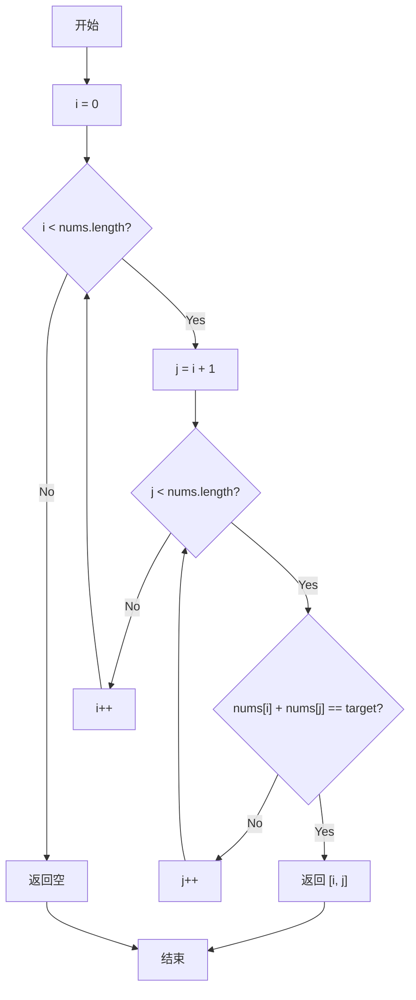
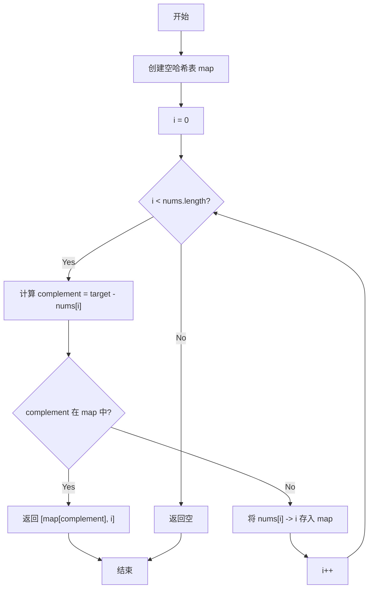
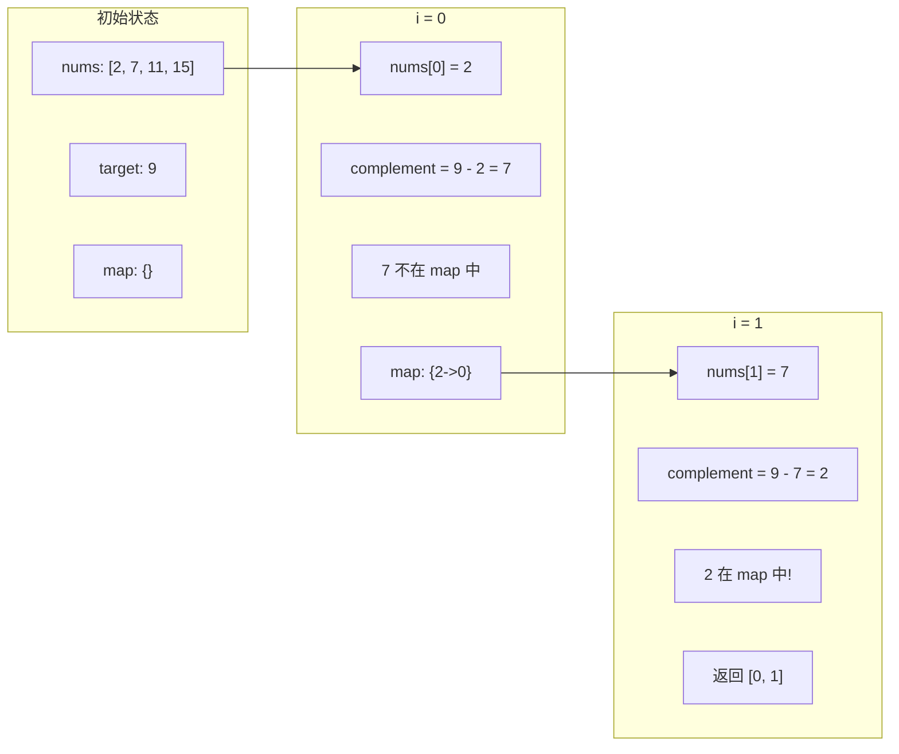

## 1. 从两数之和(2-Sum)开始

### 1.1 问题描述

> 给定一个整数数组 `nums` 和一个目标值 `target`，请你在该数组中找出和为目标值的那**两个**整数，并返回他们的数组下标。
> 
> 你可以假设每种输入只会对应一个答案。但是，数组中同一个元素不能使用两遍。

**示例：**

```
给定 nums = [2, 7, 11, 15], target = 9

因为 nums[0] + nums[1] = 2 + 7 = 9
所以返回 [0, 1]
```

### 1.2 问题分析

这是一个经典的算法问题，我们可以从暴力解法开始，逐步优化到最优解。

#### 1.2.1 暴力解法思路

最直观的方法是使用两层循环，枚举所有可能的数对：



**时间复杂度：** O(n²) - 需要遍历所有数对
**空间复杂度：** O(1) - 只使用了常数额外空间

#### 1.2.2 哈希表优化思路

暴力解法的问题在于，我们重复计算了很多和。如果能快速判断 `target - nums[i]` 是否在数组中，就能将问题简化。



**核心思想：**
- 遍历数组时，对于每个元素 `nums[i]`，我们想知道是否存在一个之前遍历过的元素等于 `target - nums[i]`
- 使用哈希表存储已经遍历过的元素及其下标，实现 O(1) 的查找

**时间复杂度：** O(n) - 只需遍历数组一次
**空间复杂度：** O(n) - 需要存储哈希表

### 1.3 代码实现

#### 1.3.1 暴力解法

```cpp
class Solution {
public:
    vector<int> twoSum(vector<int>& nums, int target) {
        int n = nums.size();
        for (int i = 0; i < n; i++) {
            for (int j = i + 1; j < n; j++) {
                if (nums[i] + nums[j] == target) {
                    return {i, j};
                }
            }
        }
        return {}; // 根据题意，一定有解，这里不会执行
    }
};
```

#### 1.3.2 哈希表优化

```cpp
class Solution {
public:
    vector<int> twoSum(vector<int>& nums, int target) {
        unordered_map<int, int> map; // value -> index
        
        for (int i = 0; i < nums.size(); i++) {
            int complement = target - nums[i];
            
            // 查找 complement 是否已存在于 map 中
            auto it = map.find(complement);
            if (it != map.end()) {
                return {it->second, i};
            }
            
            // 将当前元素存入 map
            map[nums[i]] = i;
        }
        
        return {}; // 根据题意，一定有解
    }
};
```

### 1.4 算法执行过程可视化

让我们用一个具体的例子来跟踪哈希表解法的执行过程：



### 1.5 复杂度对比

| 解法 | 时间复杂度 | 空间复杂度 | 适用场景 |
|------|-----------|-----------|----------|
| 暴力枚举 | O(n²) | O(1) | 数据量小，内存受限 |
| 哈希表 | O(n) | O(n) | 一般情况，追求速度 |

### 1.6 总结

Two Sum 问题是算法学习的经典入门题目，它展示了**空间换时间**的核心优化思想：

1. **暴力解法**直观但低效，适合理解问题
2. **哈希表优化**通过额外的空间存储中间结果，将时间复杂度从 O(n²) 降低到 O(n)

这种优化思路在很多算法问题中都有应用，比如：
- 判断数组中是否存在重复元素
- 寻找数组中的众数
- 统计字符出现频率

在下一篇文章中，我们将把这个思路扩展到**三数之和(3-Sum)**问题，探索更复杂的算法技巧。

---

## 参考

- [LeetCode 1. Two Sum](https://leetcode.com/problems/two-sum/)
- [ unordered_map - C++ Reference](https://en.cppreference.com/w/cpp/container/unordered_map)
