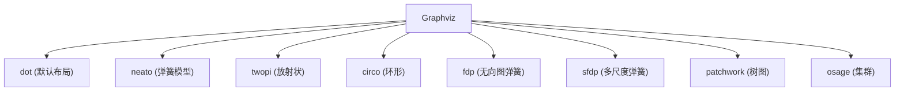

## 1. 基本使用实例

### 1.1 一个C程序的内部调用图

`如图1.1.a 所示`

```mermaid
graph TD
  graphviz[Graphviz]
  dot["dot (默认布局)"]
  neato["neato (弹簧模型)"]
  twopi["twopi (放射状)"]
  circo["circo (环形)"]
  fdp["fdp (无向图弹簧)"]
  sfdp["sfdp (多尺度弹簧)"]
  patchwork["patchwork (树图)"]
  osage["osage (集群)"]

  graphviz --> dot
  graphviz --> neato
  graphviz --> twopi
  graphviz --> circo
  graphviz --> fdp
  graphviz --> sfdp
  graphviz --> patchwork
  graphviz --> osage
```
******
`如图1.1.b 所示`

```mermaid
graph TD
  graphviz[Graphviz]
  dot["dot (默认布局)"]
  neato["neato (弹簧模型)"]
  twopi["twopi (放射状)"]
  circo["circo (环形)"]
  fdp["fdp (无向图弹簧)"]
  sfdp["sfdp (多尺度弹簧)"]
  patchwork["patchwork (树图)"]
  osage["osage (集群)"]

  graphviz --> dot
  graphviz --> neato
  graphviz --> twopi
  graphviz --> circo
  graphviz --> fdp
  graphviz --> sfdp
  graphviz --> patchwork
  graphviz --> osage
```

## 2. 从基本结构开始探险

### 2.1 Node

`如图 2.1.a 所示`

```mermaid
graph TD
  main[我是一个☝️节点,名字叫做main]
```