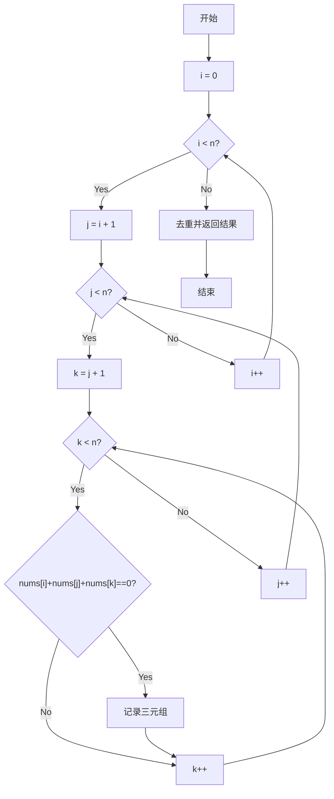
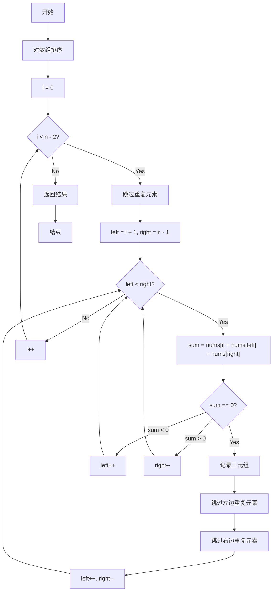
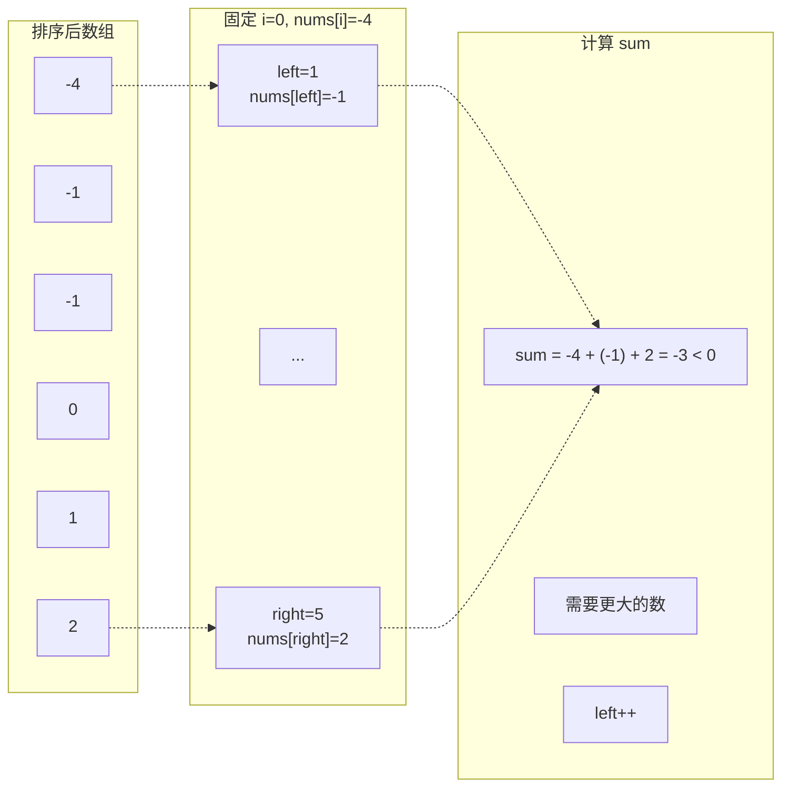
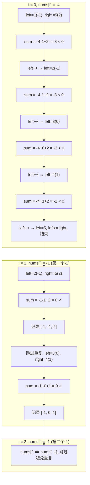
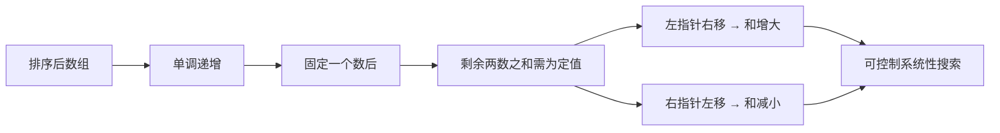
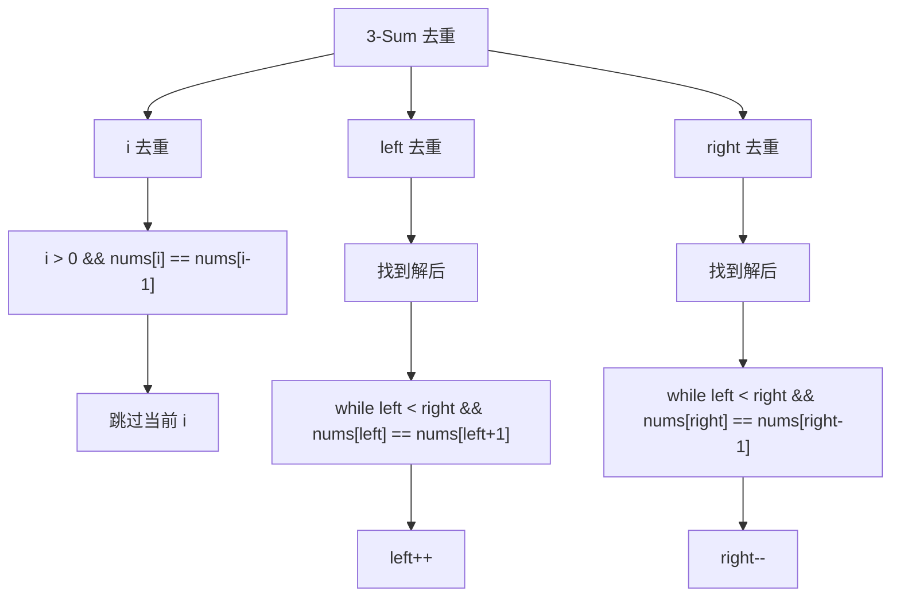
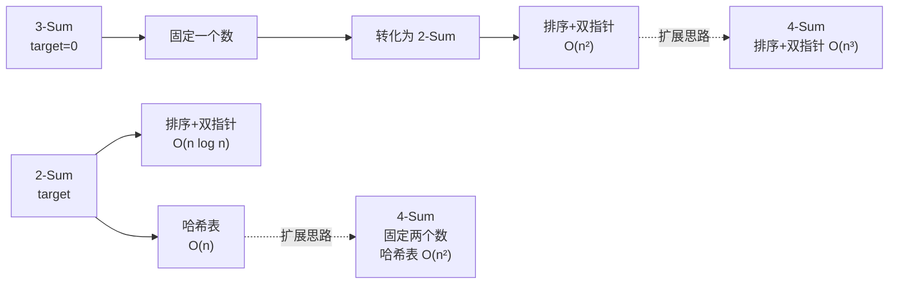

## 2. 三数之和(3-Sum)

### 2.1 问题描述

> 给你一个包含 n 个整数的数组 `nums`，判断 `nums` 中是否存在三个元素 a, b, c，使得 a + b + c = 0？
> 
> 请你找出所有**和为 0 且不重复**的三元组。

**示例：**

```
输入：nums = [-1, 0, 1, 2, -1, -4]
输出：[[-1, -1, 2], [-1, 0, 1]]

解释：
- nums[0] + nums[1] + nums[2] = (-1) + 0 + 1 = 0
- nums[1] + nums[2] + nums[4] = 0 + 1 + (-1) = 0
- nums[0] + nums[3] + nums[4] = (-1) + 2 + (-1) = 0
```

**注意：** 答案中不可以包含重复的三元组。

### 2.2 问题分析

相比 Two Sum，3-Sum 有以下难点：
1. **目标值固定为 0**（实际上是 target = 0 的特殊情况）
2. **需要返回所有满足条件的组合**，而不仅仅是一个
3. **需要去重**，避免输出重复的三元组

#### 2.2.1 暴力解法

三层循环枚举所有三元组：



**时间复杂度：** O(n³) - 三层循环
**空间复杂度：** O(k) - 存储结果，k 为结果数量

#### 2.2.2 排序 + 双指针优化

这是 3-Sum 问题的经典解法，核心思想：
1. **排序**数组，便于去重和双指针移动
2. **固定一个数**，将问题转化为 Two Sum
3. 使用**双指针**在有序数组中寻找两数之和



**核心思想图解：**



**时间复杂度：** O(n²) - 外层循环 O(n)，双指针遍历 O(n)
**空间复杂度：** O(1) 或 O(k) - 排序可能使用 O(log n) 栈空间，结果存储 O(k)

### 2.3 代码实现

#### 2.3.1 排序 + 双指针

```cpp
class Solution {
public:
    vector<vector<int>> threeSum(vector<int>& nums) {
        vector<vector<int>> result;
        int n = nums.size();
        
        // 数组长度不足 3，直接返回
        if (n < 3) return result;
        
        // 1. 排序
        sort(nums.begin(), nums.end());
        
        // 2. 固定第一个数，转化为 Two Sum 问题
        for (int i = 0; i < n - 2; i++) {
            // 优化：如果当前数已经大于 0，后面的数都大于 0，不可能和为 0
            if (nums[i] > 0) break;
            
            // 跳过重复元素，避免重复解
            if (i > 0 && nums[i] == nums[i - 1]) continue;
            
            // 3. 双指针寻找另外两个数
            int left = i + 1;
            int right = n - 1;
            
            while (left < right) {
                long long sum = (long long)nums[i] + nums[left] + nums[right];
                
                if (sum == 0) {
                    // 找到一组解
                    result.push_back({nums[i], nums[left], nums[right]});
                    
                    // 跳过左边重复元素
                    while (left < right && nums[left] == nums[left + 1]) left++;
                    // 跳过右边重复元素
                    while (left < right && nums[right] == nums[right - 1]) right--;
                    
                    left++;
                    right--;
                } else if (sum < 0) {
                    // 和小于 0，需要增大，左指针右移
                    left++;
                } else {
                    // 和大于 0，需要减小，右指针左移
                    right--;
                }
            }
        }
        
        return result;
    }
};
```

### 2.4 算法执行过程可视化

以 `nums = [-1, 0, 1, 2, -1, -4]` 为例：

**Step 1: 排序**
```
原始: [-1, 0, 1, 2, -1, -4]
排序: [-4, -1, -1, 0, 1, 2]
```

**Step 2: 遍历过程**



### 2.5 关键点总结

#### 2.5.1 为什么排序后能用双指针？



#### 2.5.2 去重的三个位置



### 2.6 复杂度对比

| 解法 | 时间复杂度 | 空间复杂度 | 特点 |
|------|-----------|-----------|------|
| 暴力枚举 | O(n³) | O(k) | 简单直接，超时 |
| 哈希表 | O(n²) | O(n) | 类似 Two Sum 扩展 |
| 排序+双指针 | O(n²) | O(1) ~ O(log n) | 最优，且易于去重 |

### 2.7 从 2-Sum 到 3-Sum 的思维演进



### 2.8 进阶：k-Sum 问题的通解思路

通过 2-Sum 和 3-Sum，我们可以总结出 k-Sum 的一般解法：

```
k-Sum 问题通用框架：

1. 排序数组（如果需要双指针）
2. 递归地固定 k-2 个数
3. 最后使用双指针解决 2-Sum 问题

时间复杂度：O(n^(k-1))
```

### 2.9 总结

3-Sum 问题教会我们的算法技巧：

1. **排序预处理** - 为双指针创造条件，同时简化去重
2. **降维思想** - 将 k-Sum 问题分解为 (k-1)-Sum 问题
3. **双指针技巧** - 利用有序性实现 O(n) 的两数搜索
4. **去重技巧** - 在循环的每个层次都要考虑重复元素的跳过

这些技巧不仅适用于 Sum 类问题，也是解决数组、字符串等问题的常用方法。

---

## 参考

- [LeetCode 15. 3Sum](https://leetcode.com/problems/3sum/)
- [LeetCode 16. 3Sum Closest](https://leetcode.com/problems/3sum-closest/)
- [LeetCode 18. 4Sum](https://leetcode.com/problems/4sum/)
