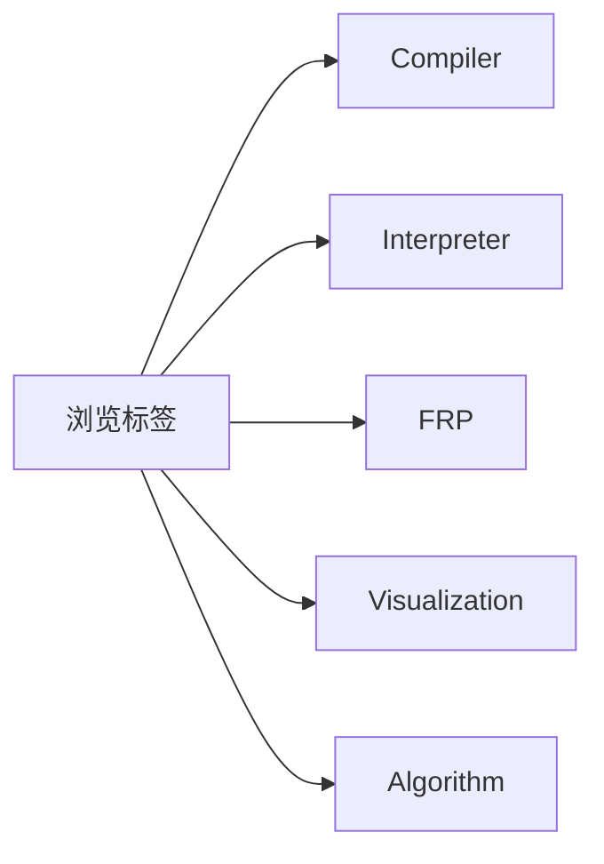

## 关于博主

你好，我是 **Arthur Blitz**，一名热爱底层技术的开发者。

我的技术兴趣主要集中在：
- **编程语言设计** - 从汇编到高级语言的完整技术栈
- **编译器与解释器** - 原理与实现
- **函数式响应式编程 (FRP)** - 理论与实践
- **可视化技术** - Graphviz、Mermaid 等工具

"编译手艺人"是我记录和分享学习心得的阵地。这里的文章不是简单的教程，而是**学习过程的完整记录**——包括思考、实验、踩坑和突破。

> **品牌口号**：术之尽头，源自我心

---

## 阅读指南

### 推荐阅读路径

| 你的目标 | 推荐起点 | 适合的文章 |
|---------|---------|-----------|
| 理解编译器原理 | [从零开始的Dot可视化历险](/blog/从零开始的dot可视化历险/) | 可视化入门 |
| 学习解释器实现 | [0x06.如何实现一个解释器 in Racket](/blog/0x06-interpreter-implementation-racket/) | 解释器系列 |
| 深入FRP | [FRP入门教程-从Sodium到响应式编程](/blog/frp-tutorial-sodium-reactive-programming/) | FRP系列 |
| 理解汇编 | [汇编研究I](/blog/汇编研究i/) | 汇编系列 |

### 文章分级

- **L1 入门** - 10分钟阅读，适合初学者
- **L2 进阶** - 20分钟阅读，需要一定基础
- **L3 硬核** - 40分钟+阅读，专家级内容

---

## 系列文章

### 核心系列

- **解释器实现系列** - 从 substitution 到环境，从环境到闭包
- **FRP 理论与实践** - Sodium、RxJS 源码解析
- **汇编语言研究** - 从 C 到汇编的完整映射
- **可视化探险** - Graphviz、Mermaid 实践

### 标签索引

---

## 技术栈

本博客使用以下技术构建：

- **Astro** - 现代静态站点生成器
- **TypeScript** - 类型安全开发
- **Graphviz** - 图表可视化
- **Mermaid** - 流程图/时序图
- **Shiki** - 代码高亮

---

## 联系与交流

- **GitHub**: [whtoo](https://github.com/whtoo)
- **博客源码**: [whtoo.github.io](https://github.com/whtoo/whtoo.github.io)

如果你也有类似的热情，欢迎交流学习。

---

## 致谢

感谢阅读到这里。